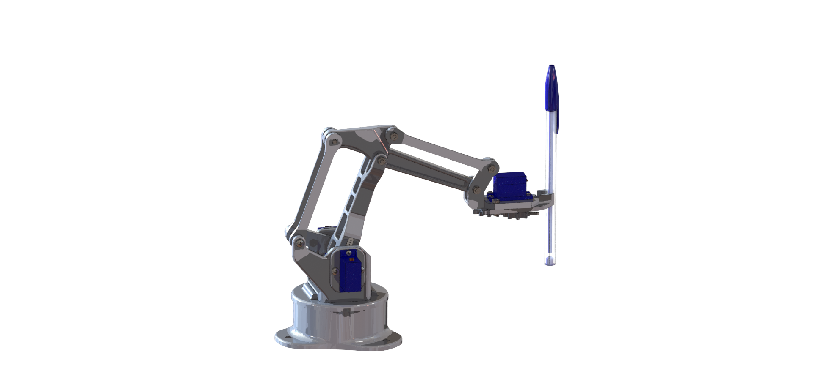

[![LinkedIn][linkedin-shield]][linkedin-url]
[![Udemy][udemy-shield]][udemy-url]


<!-- PROJECT LOGO -->
<br />
<p align="center">
   

  <h3 align="center">Arduinobot</h3>

  <p align="center">
    3D Printed robot arm powered by ROS 2 and Arduino and controlled via MoveIt! 2 and Amazon Alexa.
    <br />
    <a href="https://github.com/AntoBrandi/arduinobot/"><strong>Explore the docs »</strong></a>
    <br />
    <br />
    <a href="https://github.com/AntoBrandi/arduinobot/">View Demo</a>
    ·
    <a href="https://github.com/AntoBrandi/arduinobot/issues">Report Bug</a>
    ·
    <a href="https://github.com/AntoBrandi/arduinobot/issues">Request Feature</a>
  </p>
</p>

[![Product Name Screen Shot][product-screenshot]](https://example.com)

<!-- TABLE OF CONTENTS -->
## Table of Contents

* [About the Project](#about-the-project)
  * [Built With](#built-with)
* [Getting Started](#getting-started)
  * [Prerequisites](#prerequisites)
  * [Installation](#installation)
* [Usage](#usage)
* [Contributing](#contributing)
* [License](#license)
* [Contact](#contact)
* [Acknowledgements](#acknowledgements)


<!-- ABOUT THE PROJECT -->
## About The Project

[![Product Name Screen Shot 2][product-screenshot-2]](https://example.com)

This project aim is to build a 3 axis robot arm with simple and cheap hardware that can be easily and remotely controlled.
Despite all the other robot arms built with an Aruidno Uno that are controlled by applying joint angles, this can be controlled assigning X, Y, Z coordinates in the workspace because it implements the inverse kinamatic.
Furthermore, it implements a speech recognition module that can run on any computer with a microphone that is connected to the same Wi-Fi network 
of the robot.

This Robot is Build and Developed in the online course called: **Robotics and ROS 2 - Learn by Doing! Manipulators** and is currently available on the following platforms:

* [Udemy](https://www.udemy.com/course/robotics-and-ros-2-learn-by-doing-manipulators/?referralCode=4B27D2CF97C1E099DD4C) 

If you want more information on the course or just want to check the course material this [link](https://github.com/AntoBrandi/Robotics-and-ROS-2-Learn-by-Doing-Manipulators) is for you


### Built With
This robot is powered by:
* PC with Ubuntu 22.04 with ROS 2 Humble / Iron 
* Arduino Board
* SG90 Servo Motors (x4)

And is controlled by:
* ROS 2 Humble / Iron 

[![Product Name Screen Shot Real][product-screenshot-real]](https://example.com)


<!-- GETTING STARTED -->
## Getting Started

Once it's printed and assembled according and connected, there are few configuration to be made both in Ubuntu and in the Arduino UNO.

### Prerequisites

Make sure you install correctly the following required tools before continuing
* Install Ubuntu 22.04 on PC or in Virtual Machine
Download the ISO [Ubuntu 22.04](https://ubuntu.com/download/desktop) for your PC
* Install [ROS 2 Humble / Iron](https://docs.ros.org/en/humble/Installation/Ubuntu-Install-Debians.html) on your Ubuntu 22.04
* Install ROS 2 missing libraries. Some libraries that are used in this project are not in the standard ROS 2 package. Install them with:
```sh
sudo apt-get update && sudo apt-get install -y \
     ros-humble-joint-state-publisher-gui \
     ros-humble-gazebo-ros \
     ros-humble-xacro \
     ros-humble-ros2-control \
     ros-humble-moveit \
     ros-humble-ros2-controller \
     ros-humble-gazebo-ros2-control 
```
* Install VS Code and Arduino IDE on your PC in order to build and load the Arduino code on the device
* Install Python and C++ addistional libraries
```sh
sudo apt-get update && sudo apt-get install -y \
     libserial-dev \
     python3-pip
```

```sh
pip install pyserial
```


### Installation

1. Clone the repo
```sh
git clone https://github.com/AntoBrandi/arduinobot.git
```
2. Build the ROS 2  workspace
```sh
cd ~/Arduino-Bot/arduinobot_ws
```
```sh
colcon build
```
3. Source the ROS Workspace
```sh
. install/setup.bash
```
4. Connect the Arduino UNO to your PC and open the Arduino IDE. Open the [folder](https://github.com/AntoBrandi/Arduino-Bot/tree/noetic/arduinobot_ws/src/arduinobot_controller/arduino)
containing the code for the Arduino controller.


<!-- USAGE EXAMPLES -->
## Usage

To launch the ROS simulated robot
```sh
ros2 launch arduinobot_bringup simulated_robot.launch.py
```

To launch the real robot, connect the Arduino to the PC and upload the code in the [folder](https://github.com/AntoBrandi/Arduino-Bot/blob/humble/arduinobot_ws/src/arduinobot_firmware/firmware/robot_control/robot_control.ino) on the Arduino controller.
Then launch the real robot
```sh
ros2 launch arduinobot_bringup real_robot.launch.py
```

To launch the interface with Alexa download [ngrok](https://ngrok.com/download) and create an [account](https://dashboard.ngrok.com/signup) then setup ngrok with your key
```sh
./ngrok authtoken <YOUR-KEY>
```
Then start the ngrok web server with
```sh
./ngrok http 5000
```
Copy the link that provides ngrok and paste it in the section Endpoint of your Alexa Developer account


<!-- CONTRIBUTING -->
## Contributing

Contributions are what make the open source community such an amazing place to be learn, inspire, and create. Any contributions you make are **greatly appreciated**.

1. Fork the Project
2. Create your Feature Branch (`git checkout -b feature/AmazingFeature`)
3. Commit your Changes (`git commit -m 'Add some AmazingFeature'`)
4. Push to the Branch (`git push origin feature/AmazingFeature`)
5. Open a Pull Request


<!-- LICENSE -->
## License

Distributed under the MIT License. See `LICENSE` for more information.


<!-- CONTACT -->
## Contact

Antonio Brandi - [LinkedIn]([linkedin-url]) - antonio.brandi@outlook.it

My Projects: [https://github.com/AntoBrandi](https://github.com/AntoBrandi)


<!-- ACKNOWLEDGEMENTS -->
## Acknowledgements
* [Arduino 3D-Printed Robotic Arm](https://create.arduino.cc/projecthub/mircemk/arduino-3d-printed-robotic-arm-e824d8?ref=search&ref_id=robot%20arm&offset=86)
* [EEZYbotARM](https://www.thingiverse.com/thing:1015238)


<!-- MARKDOWN LINKS & IMAGES -->
[linkedin-shield]: https://img.shields.io/badge/-LinkedIn-black.svg?style=flat-square&logo=linkedin&colorB=555
[linkedin-url]: https://www.linkedin.com/in/antonio-brandi-512166bb/
[udemy-shield]: https://img.shields.io/badge/-Udemy-black.svg?style=flat-square&logo=udemy&colorB=555
[udemy-url]: https://www.udemy.com/course/robotics-and-ros-2-learn-by-doing-manipulators/?referralCode=4B27D2CF97C1E099DD4C/
[product-screenshot]: images/BB3A0020.jpg
[product-screenshot-2]: images/BB3A0026.jpg
[product-screenshot-real]: images/screen_video.png
