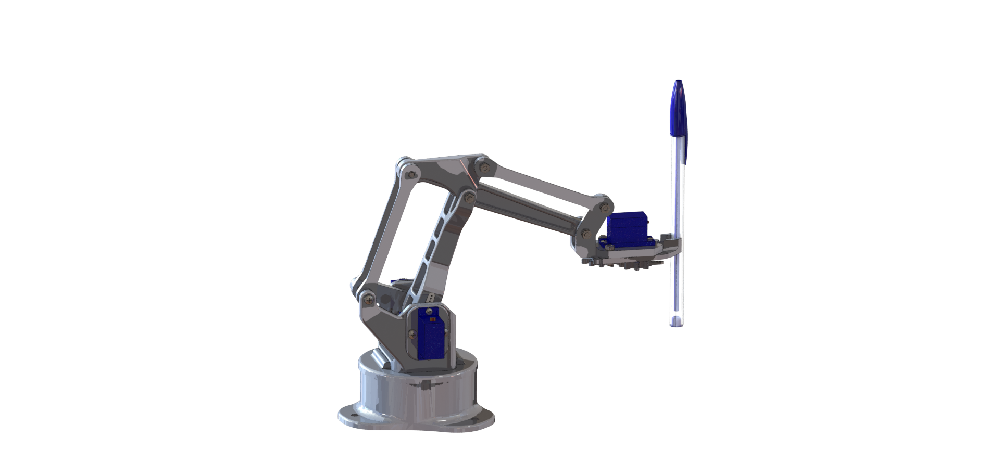
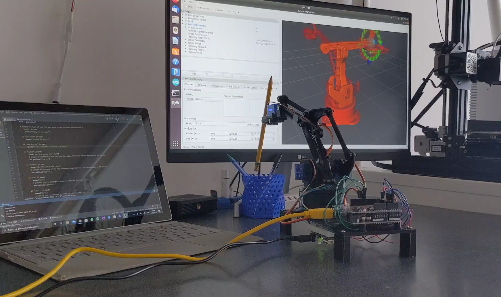

[![LinkedIn][linkedin-shield]][linkedin-url]
[![Udemy][udemy-shield]][udemy-url]


<p align="center">
  
</p>

Arduinobot is an open-source 3D printed robot arm powered by ROS 2. Its simple design and low cost make it an excellent learning tool, featured in the [Robotics and ROS 2 - Learn by Doing! Manipulators](https://www.udemy.com/course/robotics-and-ros-2-learn-by-doing-manipulators/?referralCode=4B27D2CF97C1E099DD4C) course.


## :robot: Features

- :rocket: [`arduinobot_bringup`](./arduinobot_bringup): Contains launch files that starts all the functionalities of the real or simulated robot.
- :video_game: [`arduinobot_controller`](./arduinobot_controller): Contains the [ROS 2 Control](https://control.ros.org/rolling/index.html) configuration and Hardware interface with the real robot.
- :paperclip: [`arduinobot_cpp_examples`](./arduinobot_cpp_examples): Contains ROS 2 templates for developing with C++.
- :ledger: [`arduinobot_description`](./arduinobot_description): Contains the URDF description of the robot and its Gazebo simulation.
- :battery: [`arduinobot_firmware`](./arduinobot_firmware): Contains the Arduino code for actuating the motors of the real robot.
- :brain: [`arduinobot_moveit`](./arduinobot_moveit): Contains the [MoveIt 2](https://moveit.picknik.ai/main/index.html) configuration and launch files.
- :email: [`arduinobot_msgs`](./arduinobot_msgs/): Contains the definition of new ROS 2 message interfaces.
- :paperclip: [`arduinobot_py_examples`](./arduinobot_py_examples/): Contains ROS 2 templates for developing with Python.
- :speaking_head: [`arduinobot_remote`](./arduinobot_remote/): Contains the remote interface to move the robot using the [Amazon Alexa](https://www.alexa.com/) voice assistant.
- :hammer_and_pick: [`arduinobot_utils`](./arduinobot_utils/): Contains some utilities and tools.

## :building_construction: Usage

This robot and its simulation can be used with an Ubuntu 22.04 machine running ROS 2 Humble or and Ubuntu 24.04 machine running ROS 2 Jazzy.

### Prerequisites

* Install [Ubuntu 24.04](https://ubuntu.com/download/desktop) or [Ubuntu 22.04](https://releases.ubuntu.com/jammy/) on your PC or in a Virtual Machine.
* Install [ROS 2 Jazzy](https://docs.ros.org/en/jazzy/Installation/Ubuntu-Install-Debians.html) if you are on Ubuntu 24.04. Otherwise, install [ROS 2 Humble](https://docs.ros.org/en/jazzy/Installation/Ubuntu-Install-Debians.html) if you are on Ubuntu 22.04
* Install ROS 2 missing libraries. Some libraries that are used in this project are not in the standard ROS 2 package. Install them with:
* Install [VS Code](https://code.visualstudio.com/) and [Arduino IDE](https://docs.arduino.cc/software/ide-v2/tutorials/getting-started/ide-v2-downloading-and-installing/) on your PC in order to build and load the Arduino code on the device
* Install Python and C++ addistional libraries
```sh
sudo apt-get update && sudo apt-get install -y \
     libserial-dev \
     python3-pip
```

```sh
pip install pyserial
pip install flask
pip install flask-ask-sdk
pip install ask-sdk
```


### Installation

1. Create a Workspace
```sh
mkdir -p arduinobot/src
```

2. Clone this repo
```sh
cd arduinobot_ws/src
git clone https://github.com/AntoBrandi/arduinobot.git
```

3. Install the dependencies
```sh
cd ..
rosdep install --from-paths src --ignore-src -i -y
```

4. Build the workspace
```sh
colcon build
```

5. Source the ROS Workspace (Use this command in a separate terminal from the one you used to build the workspace)
```sh
. install/setup.bash
```

#### :computer: Simulation

6. Launch all the functionalities for the simulated robot
```sh
ros2 launch arduinobot_bringup simulated_robot.launch.py
```

#### :mechanical_arm: Real Robot

7. Connect the Arduino actuating your robot to your PC and load the [robot_control.ino](./arduinobot_firmware/firmware/robot_control/robot_control.ino) script using the Arduino IDE.
```sh
ros2 launch arduinobot_bringup simulated_robot.launch.py
```

8. Launch all the functionalities for the real robot
```sh
ros2 launch arduinobot_bringup real_robot.launch.py
```

## :selfie: Media
<p align="center">
  <video controls>
    <source src="media/demo_pick.mp4" type="video/mp4">
  </video>
  
  
  
</p>

## :raised_hands: Contributing

Contributions are what make the open source community such an amazing place to be learn, inspire, and create. Any contributions you make are **greatly appreciated**.
Please refer to [CONTRIBUTING](CONTRIBUTING.md) doc.

## :star2: Acknowledgements
* [Arduino 3D-Printed Robotic Arm](https://create.arduino.cc/projecthub/mircemk/arduino-3d-printed-robotic-arm-e824d8?ref=search&ref_id=robot%20arm&offset=86)
* [EEZYbotARM](https://www.thingiverse.com/thing:1015238)

## :link: Contact

Antonio Brandi - [LinkedIn]([linkedin-url]) - antonio.brandi@outlook.it
My Projects: [https://github.com/AntoBrandi](https://github.com/AntoBrandi)


[linkedin-shield]: https://img.shields.io/badge/-LinkedIn-black.svg?style=flat-square&logo=linkedin&colorB=555
[linkedin-url]: https://www.linkedin.com/in/antonio-brandi-512166bb/
[udemy-shield]: https://img.shields.io/badge/-Udemy-black.svg?style=flat-square&logo=udemy&colorB=555
[udemy-url]: https://www.udemy.com/course/robotics-and-ros-2-learn-by-doing-manipulators/?referralCode=4B27D2CF97C1E099DD4C/
